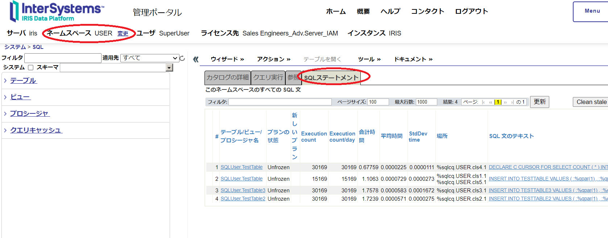
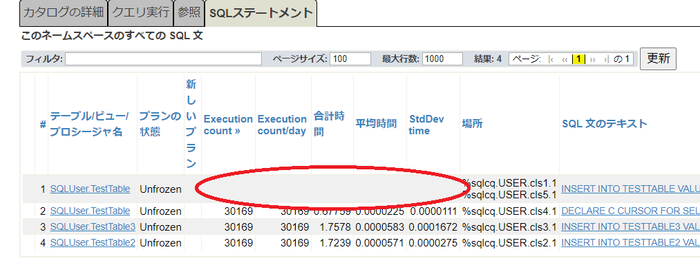
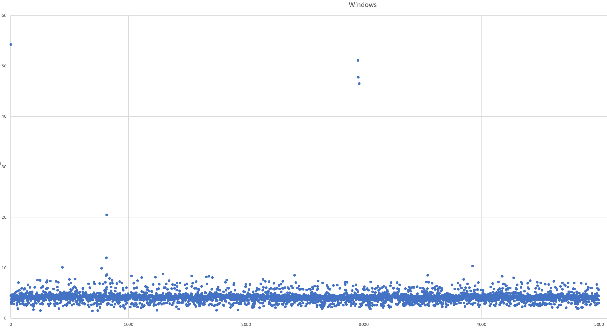
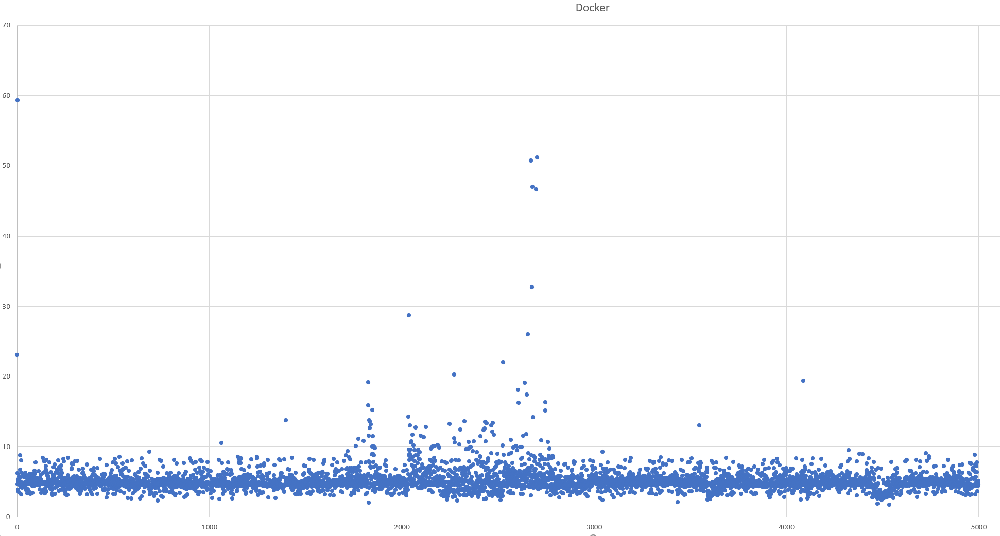
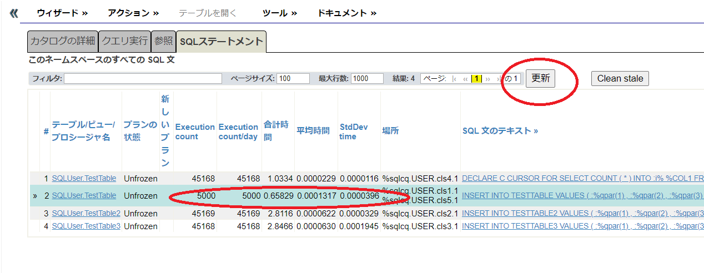

# ADO
## 環境

IRIS データベースバッファサイズ: 2048 MB  
Windows版:IRIS for Windows (x86-64) 2021.2.1 (Build 654U) Fri Mar 18 2022 06:09:35 EDT  
コンテナ版:IRIS for UNIX (Ubuntu Server LTS for x86-64 Containers) 2021.2 (Build 651U) Mon Jan 31 2022 18:07:01 EST

mem_limitによりIRISコンテナ,dotnetコンテナへの割り当てを1GBに設定している。  
VM使用時はメモリ割り当てを最低でも4GB、wsl2使用時は.wslconfigにてメモリ設定を行うことが望ましい。
```
[wsl2]
memory=4GB
```

```
$ docker stats
CONTAINER ID   NAME           CPU %     MEM USAGE / LIMIT   MEM %     NET I/O           BLOCK I/O   PIDS
2c833b431248   ado_iris_1     0.06%     319.5MiB / 1GiB     31.20%    3.43kB / 3.62kB   0B / 0B     58
a097bb2b6f61   ado_dotnet_1   0.00%     1.688MiB / 1GiB     0.16%     1.11kB / 0B       0B / 0B     1
```

## 処理概要
テーブルを3つ作成し、Loop内を指定回数分繰り返す。
```
DROP TABLE TestTable
DROP TABLE TestTable2
DROP TABLE TestTable3
CREATE TABLE TestTable ...
CREATE TABLE TestTable2 ...
CREATE TABLE TestTable3 ...
Loop {
    INSERT TestTable
    INSERT TestTable2
    SELECT COUNT(*) FROM INSERT TestTable WHERE ...
    INSERT TestTable3
}
```
作成されるテーブルサイズはごく小さく、IRISのキャッシュメモリ(2048 MB)にすべて載る程度。

## 実行方法

製品版使用時にはInterSystemsのcontainerレポジトリへのログインおよびlicenseフォルダ下にiris.keyが必要です。  
また、下記を変更してから実行してください。
```
前>    image: containers.intersystems.com/intersystems/iris-community:2021.2.0.651.0
後>    image: containers.intersystems.com/intersystems/iris:2021.2.0.651.0
```

### 書式  
ADO.exe SleepTime(ms) host port 繰り返し回数


### クライアントもコンテナを使用する場合

```
$ docker compose up -d
$ docker compose exec dotnet /source/dotnet60/build.sh
$ docker compose exec dotnet dotnet /app/ADO.dll 100 iris 1972 5000
$ docker compose exec dotnet dotnet /app/ADO.dll 100 iris 1972 5000 > result.txt
```
5000回の繰り返しには500秒ほどかかります。  

### クライアントはWindowsネイティブで使用する場合

```
$ docker compose up -d iris
```

Visual Studio等でビルド実行。  
```
> ADO.exe 100 192.168.11.2 1972 
> ADO.exe 100 192.168.11.2 1972 > result.txt
```

### 計測時の注意

初回実行時は、クエリプランの作成、データベースの拡張などが伴う可能性があるため、2回目以降を計測すること。  
ADO.exeの出力に加えて、ネットワークの影響等を受けない計測値として、IRISの[SQL統計情報](https://docs.intersystems.com/iris20212/csp/docbook/DocBook.UI.Page.cls?KEY=GSQLOPT_sqlstmts#GSQLOPT_sqlstmts_det_statssec)を使用する。そのために、1回目(あるいは今まで実行してきた結果)の統計情報を消去するために、1回目のADO.exe実行の直後に、下記手順にて、クエリの統計情報をクリアしておく。以下、手順。

1.  管理ポータルで[システムエクスプローラー]->[SQL]と進み、ネームスペースを使用しているデータベースに切り替え、さらに[SQLステートメント]タブを選択する。  
|

2. 統計取得を行うSQL文をクリックする  
ここでは2番目のINSERT INTO TESTTABLE VALUES ( :%qpar(1) , :%qpar(2) , :%qpar(3)...というSQL文をクリックすると、ブラウザの新規タブがポップアップする。[SQL統計情報をクリア]を押し、今までに蓄積された統計値を削除する。
|

3. 統計値がクリアされたことの確認  
ブラウザのタブを閉じる。クエリの統計情報(Execution countなど)が空になっていることを確認する。

|

## 計測結果の例
Windows10ホスト(ADO Client用)から物理的に別のWindows10ホスト上のIRISサーバに対して実行。
> (注意)使用環境は計測に「理想」とは言えない環境なので、傾向を把握することが目的としている。  
> 通信はWi-Fi経由。クライアント、サーバ共にセキュリティ対策ソフトあり。

2ホスト間の遅延発生具合は下記の通り。
```
>ping 192.168.11.2
192.168.11.2 に ping を送信しています 32 バイトのデータ:
192.168.11.2 からの応答: バイト数 =32 時間 =2ms TTL=128
192.168.11.2 からの応答: バイト数 =32 時間 =3ms TTL=128
192.168.11.2 からの応答: バイト数 =32 時間 =2ms TTL=128
192.168.11.2 からの応答: バイト数 =32 時間 =3ms TTL=128

192.168.11.2 の ping 統計:
    パケット数: 送信 = 4、受信 = 4、損失 = 0 (0% の損失)、
ラウンド トリップの概算時間 (ミリ秒):
    最小 = 2ms、最大 = 3ms、平均 = 2ms
```
### 計測値

|IRIS環境|計測値|備考|
|:---|:---|:---|
|Windows版IRIS|[実行結果](results/sleep100-win.txt)||
|コンテナ版(同Windows上のWSL2)|[実行結果](results/sleep100-docker.txt)||

### Windows版散布図

|

### コンテナ版散布図

|

### SQL統計の確認

SQL統計値に使用する情報(生データ)はクエリを実行したプロセスが終了することで永続領域に記録される。
> コネクションプールを使用している場合、実行イメージそのものの終了が必要

また永続領域の記録から統計値への反映までに、10～15分ほど要する。反映を強制するために計測(ADO.exe実行)終了後に、下記のコマンドを実行する。
```
$ docker compose exec iris iris session iris "UpdateSQLStats^%SYS.SQLSRV()"
あるいはIRISのターミナル内から
USER>w $$UpdateSQLStats^%SYS.SQLSRV()
1
USER>
```

1.  管理ポータルで[システムエクスプローラー]->[SQL]と進み、ネームスペースを使用しているデータベースに切り替え、さらに[SQLステートメント]タブを選択し、[更新]ボタンを押す。  これで、今、実行した計測内容が反映される。
|

この結果からは、INSERT INTO TESTTABLE VALUES...が5,000回実行され、合計時間:0.65829(秒)、平均時間:0.0001317(秒)、標準偏差:0.0000396であることがわかる。

> 0.0001317(秒)=0.1317(ミリ秒)

## how to forward wsl2 port to an external host.

```
netsh.exe interface portproxy add v4tov4 listenaddress=192.168.11.2 listenport=1972 connectaddress=172.25.29.22 connectport=1972
```

## hints
https://qiita.com/kunihirotanaka/items/a536ee35d589027e4a5a
